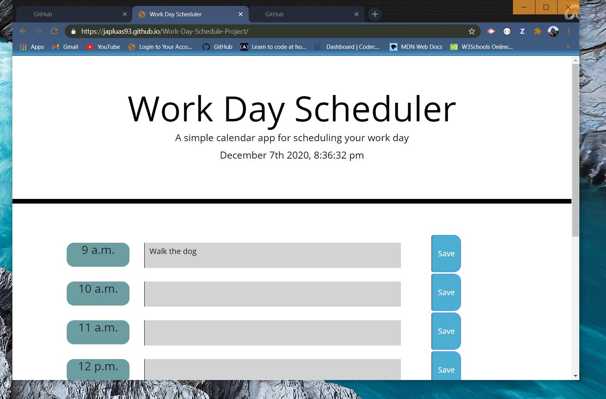

# Work-Day-Schedule-Project

Hi there. This is a simple daily planner application that I designed to help anyone manage their busy schedule. The times are set from 9AM - 6PM.

Working on this appliication gave me a lot of confidence with my HTML and CSS skills. After looking at the sample application I knew right away that I was going to need to use come kind of CSS framework. I used Bootstrap because I wanted to get more practice using the row and columns syntax. The application is for the most part responsive and it also has working client side storage functionality. Whenever the user inputs some text in the input area and presses the save button that data will remain in the input area, even after you refresh the page.

Thank you for checking out my application. Happy scheduling!

